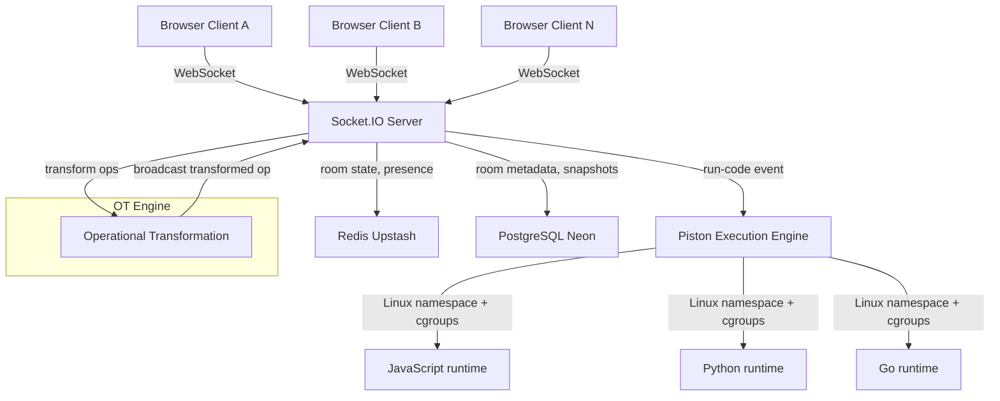

# Real Time Code Collaboration

A real-time collaborative code editor where multiple users can edit code simultaneously, see each other's cursors, chat, and run code in an isolated sandbox. Built to demonstrate WebSockets, Operational Transformation, distributed state management, and container-based execution isolation.

Live demo: [codecollabify.vercel.app](https://codecollabify.vercel.app)

---

## Features

- Real-time multi-user editing with Operational Transformation for conflict resolution
- Live cursor presence with per-user color and name tag
- Room system with shareable links and user presence list
- Real-time chat alongside the editor with join and leave system messages
- JavaScript, Python, and Go support with syntax highlighting per language
- Language selector synced across all users in the room
- Sandboxed code execution via Piston engine
- Disconnection detection and automatic rejoin on reconnect
- Username persisted across page refreshes

---

## Tech Stack

| Layer | Technology |
|---|---|
| Frontend | React, TypeScript, Vite, Tailwind CSS v4 |
| Editor | Monaco Editor |
| Realtime | Socket.IO |
| Backend | Node.js, Express, TypeScript |
| ORM | Prisma |
| Database | PostgreSQL (Neon) |
| Cache | Redis (Upstash) |
| Execution | Piston sandbox engine |
| Deployment | Vercel (frontend), Render (backend) |

---

## Architecture



---

## How Operational Transformation Works

Every edit in the editor is an operation — insert N chars at position X, or delete N chars at position X. When two users type simultaneously both operations are based on the same document revision. Without conflict resolution the documents diverge.

OT solves this with a central server as the authority:

```
Client A sends: insert "hello" at position 0, revision 3
Client B sends: insert "world" at position 0, revision 3

Server receives A first, applies it, revision becomes 4.
Server receives B at revision 3.
Server transforms B against A: position shifts from 0 to 5.
Server applies transformed B, revision becomes 5.
Server broadcasts transformed ops to all clients.

Both clients converge to "helloworld". Guaranteed.
```

The transform functions handle all four cases — insert vs insert, insert vs delete, delete vs insert, delete vs delete — and are implemented from scratch in `apps/server/src/ot/engine.ts`.

OT was chosen over CRDT because this system has a central server, the data is plain text, and the transform functions are provably correct and fully understandable. CRDT adds bundle size and complexity without benefit for a server-mediated system.

---

## Execution Sandbox

Code execution uses the Piston engine which isolates each submission using Linux namespaces and cgroups — the same isolation mechanism used by competitive programming judges. Each run gets:

- A separate filesystem (cannot read server files)
- CPU time limit (kills infinite loops)
- Memory limit (kills memory bombs)
- No network access (cannot make outbound requests)
- Process limit (cannot fork bomb)

The server never executes user code directly. The full pipeline is:

```
run-code socket event
  → rate limit check (1 run per 10 seconds per user)
  → code size check (max 50KB)
  → submit to Piston API
  → poll for result
  → run-result socket event back to client
```

Production currently uses a mock implementation pending a privileged container host. The full Piston integration is complete in `apps/server/src/execution/piston.ts`. Run locally with Docker using the `--privileged` flag for real sandboxed execution.

---

## Socket Event Map

| Event | Direction | Purpose |
|---|---|---|
| `join-room` | client to server | enter a room with username |
| `room-state` | server to client | full state on join |
| `op` | client to server | document operation |
| `op-broadcast` | server to client | transformed op to all peers |
| `cursor-move` | client to server | cursor position update |
| `cursor-broadcast` | server to client | peer cursor positions |
| `chat-message` | client to server | send chat message |
| `chat-broadcast` | server to client | chat to all in room |
| `run-code` | client to server | submit code for execution |
| `run-result` | server to client | execution result |
| `user-joined` | server to all | presence notification |
| `user-left` | server to all | presence notification |
| `language-change` | client to server | change room language |
| `language-changed` | server to all | language update broadcast |

---

## Data Model

Redis stores hot data with a 24 hour TTL:

```
room:{id}:doc          current document content
room:{id}:revision     current revision number
room:{id}:users        hash of userId to User object
room:{id}:language     current language
room:{id}:ops          operation history list
room:{id}:chat         last 50 chat messages
```

PostgreSQL stores persistent room metadata via Prisma:

```prisma
model Room {
  id         String   @id
  language   String   @default("javascript")
  createdAt  BigInt
  lastActive BigInt
}
```

---

## Project Structure

```
collab-editor/
  apps/
    client/               React frontend
      src/
        components/
          Editor.tsx        Monaco editor with OT and cursor decorations
          Chat.tsx          Real-time chat panel
          OutputPanel.tsx   Code execution results
          LanguageSelector.tsx
          UsernameModal.tsx
          ConnectionBanner.tsx
        hooks/
          useSocket.ts      Socket.IO client singleton
          useOT.ts          OT revision tracking
        pages/
          Home.tsx          Room creation
          Room.tsx          Main editor room
          NotFound.tsx      Room not found
    server/               Node.js backend
      src/
        ot/
          engine.ts         Transform and apply functions
        rooms/
          roomManager.ts    Room CRUD, Redis operations
          roomSocket.ts     Socket event handlers
          roomRoutes.ts     HTTP endpoints
        execution/
          piston.ts         Piston integration with mock fallback
        db/
          prisma.ts         Prisma client
          redis.ts          Redis client and key helpers
      prisma/
        schema.prisma
  packages/
    shared/               Shared TypeScript types
      src/types/
        events.ts           Socket event types
        room.ts             Room, User, Language types
        op.ts               Operation types
```

---

## Local Development

Prerequisites: Node.js 18+, Docker Desktop

```bash
git clone https://github.com/your-username/collab-editor
cd collab-editor
npm install
```

Start Redis and Postgres:

```bash
docker run -d --name collab-redis -p 6379:6379 redis:7-alpine

docker run -d --name collab-postgres \
  -e POSTGRES_PASSWORD=postgres \
  -e POSTGRES_DB=collabeditor \
  -p 5432:5432 postgres:15-alpine
```

Create environment file:

```bash
cp apps/server/.env.example apps/server/.env
```

Run database migration:

```bash
npx prisma db push --schema=apps/server/prisma/schema.prisma
```

Start both servers:

```bash
npm run dev
```

Frontend runs at `http://localhost:5173`, backend at `http://localhost:3001`.

---

## Running Piston Locally on Windows

Piston requires privileged Docker mode which does not work on Windows Docker Desktop directly. Run it with a volume mount:

```bash
docker run -d \
  --name piston \
  -p 2000:2000 \
  --privileged \
  -v /piston:/piston \
  --restart always \
  ghcr.io/engineer-man/piston
```

Install runtimes via the API from inside the container:

```bash
docker exec -it piston bash
```

Then inside the container install each runtime:

```bash
node -e "
const http = require('http');
const data = JSON.stringify({language:'javascript',version:'18.15.0'});
const req = http.request({host:'localhost',port:2000,path:'/api/v2/packages',method:'POST',headers:{'Content-Type':'application/json','Content-Length':data.length}},res=>{let b='';res.on('data',d=>b+=d);res.on('end',()=>console.log(b))});
req.write(data);req.end();
"
```

Verify runtimes installed:

```bash
node -e "const http=require('http');http.get('http://localhost:2000/api/v2/runtimes',(res)=>{let b='';res.on('data',d=>b+=d);res.on('end',()=>console.log(b))});"
```

Exit the container and add to `apps/server/.env`:

```
PISTON_API_URL=http://localhost:2000/api/v2
NODE_ENV=development
```

---

## Environment Variables

### Server

| Variable | Description |
|---|---|
| `PORT` | Server port, default 3001 |
| `CLIENT_URL` | Frontend URL for CORS |
| `DATABASE_URL` | PostgreSQL connection string |
| `REDIS_URL` | Redis connection string |
| `PISTON_API_URL` | Piston API base URL, mock used if unset |
| `NODE_ENV` | Set to production for real Piston execution |

### Client

| Variable | Description |
|---|---|
| `VITE_SERVER_URL` | Backend URL |

---

## Security Considerations

- Rate limiting on op events: 50 operations per second per socket
- Rate limiting on code execution: 1 run per 10 seconds per socket
- Maximum code size: 50KB
- Maximum chat message size: 500 characters
- Room IDs are UUIDs — unguessable, no room listing endpoint
- CORS locked to frontend URL only
- User code never touches eval, vm, Function, or child_process
- Piston sandboxes have no network access

---

## Deployment

| Service | Platform |
|---|---|
| Frontend | Vercel |
| Backend | Render |
| PostgreSQL | Neon |
| Redis | Upstash |
| Execution | Piston on privileged Linux host |

---